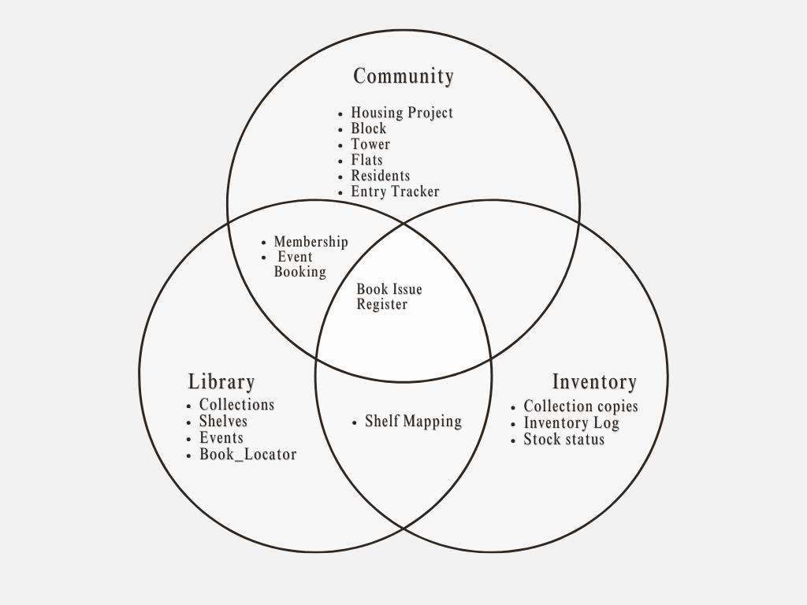

## Overview

This project is to analyze the library dataset within a residental complex. 

## Step 1 : Data Points Identification

### High-level hierarchy flow 

The major aspects of this project are as below

   
